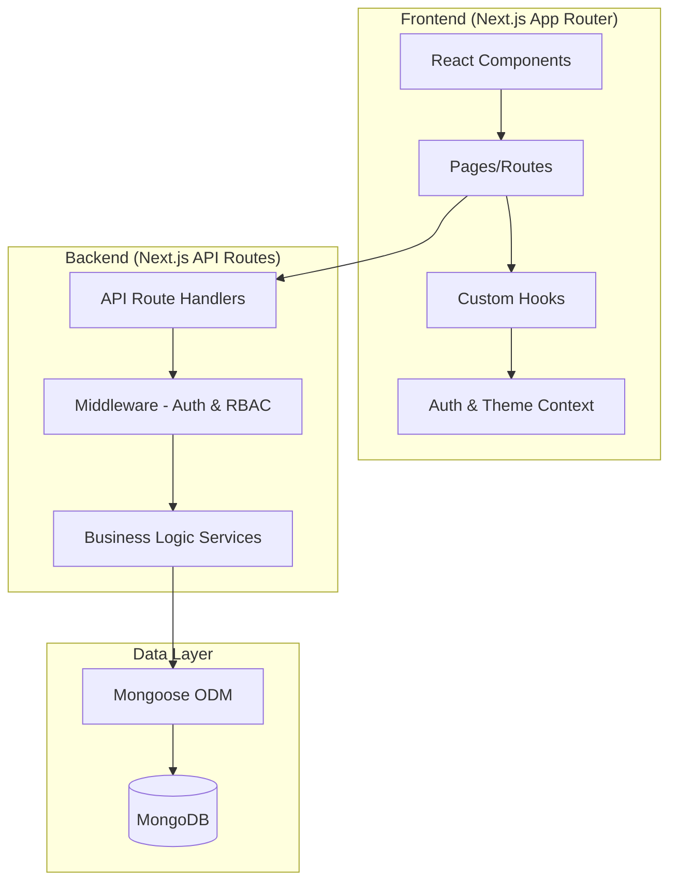

# Design Document: Food Ordering RBAC System

## Overview

This document outlines the technical design for a Food Ordering Web Application with Role-Based Access Control (RBAC) and country-based data isolation. The system is built as a full-stack Next.js 14 application with MongoDB for data persistence.

The application supports three user roles (Admin, Manager, Team Member) with varying permission levels, and implements geographical data isolation where non-Admin users can only access data within their assigned country (India or America).

## Architecture



### Project Structure

```
food-ordering-rbac/
├── src/
│   ├── app/                    # Next.js App Router
│   │   ├── (auth)/            # Auth routes (login)
│   │   ├── (dashboard)/       # Protected routes
│   │   │   ├── restaurants/
│   │   │   ├── orders/
│   │   │   ├── cart/
│   │   │   └── settings/
│   │   ├── api/               # API Routes
│   │   │   ├── auth/
│   │   │   ├── restaurants/
│   │   │   ├── orders/
│   │   │   └── payments/
│   │   ├── layout.tsx
│   │   └── page.tsx
│   ├── components/            # React Components
│   │   ├── ui/               # Reusable UI components
│   │   ├── layout/           # Layout components
│   │   └── features/         # Feature-specific components
│   ├── contexts/             # React Contexts
│   │   ├── AuthContext.tsx
│   │   └── ThemeContext.tsx
│   ├── hooks/                # Custom React Hooks
│   ├── lib/                  # Utilities & Config
│   │   ├── db.ts            # MongoDB connection
│   │   ├── auth.ts          # JWT utilities
│   │   └── rbac.ts          # Permission utilities
│   ├── models/              # Mongoose Models
│   ├── services/            # Business Logic
│   └── types/               # TypeScript Types
├── tests/                   # Test files
├── .env.local              # Environment variables
└── package.json
```

## Components and Interfaces

### Authentication Components

```typescript
// AuthContext - Manages authentication state
interface AuthContextType {
  user: User | null;
  isLoading: boolean;
  login: (email: string, password: string) => Promise<void>;
  logout: () => Promise<void>;
}

// Login Form Component
interface LoginFormProps {
  onSuccess?: () => void;
}
```

### RBAC Components

```typescript
// Permission Guard - Wraps components requiring specific permissions
interface PermissionGuardProps {
  children: React.ReactNode;
  requiredRole?: Role[];
  requiredPermission?: Permission;
  fallback?: React.ReactNode;
}

// Role-Based Navigation
interface NavItem {
  label: string;
  href: string;
  icon: React.ComponentType;
  roles: Role[];  // Roles that can see this item
}
```

### Restaurant & Menu Components

```typescript
interface RestaurantCardProps {
  restaurant: Restaurant;
  onSelect: (id: string) => void;
}

interface MenuItemCardProps {
  item: MenuItem;
  onAddToCart: (item: MenuItem, quantity: number) => void;
}

interface MenuListProps {
  restaurantId: string;
  items: MenuItem[];
}
```

### Cart & Order Components

```typescript
interface CartItemProps {
  item: CartItem;
  onUpdateQuantity: (id: string, quantity: number) => void;
  onRemove: (id: string) => void;
}

interface CartSummaryProps {
  items: CartItem[];
  total: number;
  onCheckout: () => void;
  canCheckout: boolean;  // Based on role
}

interface OrderCardProps {
  order: Order;
  onCancel?: (orderId: string) => void;
  canCancel: boolean;  // Based on role
}
```

### Theme Components

```typescript
interface ThemeContextType {
  theme: 'light' | 'dark';
  toggleTheme: () => void;
}

interface ThemeToggleProps {
  className?: string;
}
```

## Data Models

### User Model

```typescript
interface User {
  _id: string;
  email: string;
  password: string;  // Hashed
  name: string;
  role: 'admin' | 'manager' | 'member';
  country: 'india' | 'america';
  createdAt: Date;
  updatedAt: Date;
}

// Mongoose Schema
const UserSchema = new Schema({
  email: { type: String, required: true, unique: true },
  password: { type: String, required: true },
  name: { type: String, required: true },
  role: { type: String, enum: ['admin', 'manager', 'member'], required: true },
  country: { type: String, enum: ['india', 'america'], required: true },
}, { timestamps: true });
```

### Restaurant Model

```typescript
interface Restaurant {
  _id: string;
  name: string;
  description: string;
  cuisine: string;
  country: 'india' | 'america';
  imageUrl: string;
  rating: number;
  isActive: boolean;
  createdAt: Date;
  updatedAt: Date;
}

interface MenuItem {
  _id: string;
  restaurantId: string;
  name: string;
  description: string;
  price: number;
  category: string;
  imageUrl: string;
  isAvailable: boolean;
}
```

### Order Model

```typescript
interface Order {
  _id: string;
  userId: string;
  restaurantId: string;
  items: OrderItem[];
  status: 'pending' | 'placed' | 'cancelled';
  total: number;
  country: 'india' | 'america';
  paymentMethodId?: string;
  cancelledAt?: Date;
  cancelReason?: string;
  createdAt: Date;
  updatedAt: Date;
}

interface OrderItem {
  menuItemId: string;
  name: string;
  price: number;
  quantity: number;
}

interface CartItem extends OrderItem {
  restaurantId: string;
  restaurantName: string;
}
```

### Payment Method Model

```typescript
interface PaymentMethod {
  _id: string;
  name: string;
  type: 'credit_card' | 'debit_card' | 'upi';
  lastFourDigits: string;
  isDefault: boolean;
  createdAt: Date;
  updatedAt: Date;
}
```

### RBAC Permission Matrix

```typescript
type Role = 'admin' | 'manager' | 'member';
type Permission = 
  | 'view_restaurants'
  | 'create_order'
  | 'place_order'
  | 'cancel_order'
  | 'manage_payments';

const ROLE_PERMISSIONS: Record<Role, Permission[]> = {
  admin: ['view_restaurants', 'create_order', 'place_order', 'cancel_order', 'manage_payments'],
  manager: ['view_restaurants', 'create_order', 'place_order', 'cancel_order'],
  member: ['view_restaurants', 'create_order'],
};

// Check if role has permission
function hasPermission(role: Role, permission: Permission): boolean {
  return ROLE_PERMISSIONS[role].includes(permission);
}
```

### Sample Data (Seed)

```typescript
// Users
const users = [
  { email: 'nick@slooze.com', name: 'Nick Fury', role: 'admin', country: 'america' },
  { email: 'marvel@slooze.com', name: 'Captain Marvel', role: 'manager', country: 'india' },
  { email: 'america@slooze.com', name: 'Captain America', role: 'manager', country: 'america' },
  { email: 'thanos@slooze.com', name: 'Thanos', role: 'member', country: 'india' },
  { email: 'thor@slooze.com', name: 'Thor', role: 'member', country: 'india' },
  { email: 'travis@slooze.com', name: 'Travis', role: 'member', country: 'america' },
];
```


## Error Handling

### API Error Response Format

```typescript
interface ApiError {
  success: false;
  error: {
    code: string;
    message: string;
    details?: Record<string, string>;
  };
}

interface ApiSuccess<T> {
  success: true;
  data: T;
}

type ApiResponse<T> = ApiSuccess<T> | ApiError;
```

### Error Codes

| Code | HTTP Status | Description |
|------|-------------|-------------|
| `AUTH_INVALID_CREDENTIALS` | 401 | Invalid email or password |
| `AUTH_UNAUTHORIZED` | 401 | Missing or invalid JWT token |
| `AUTH_FORBIDDEN` | 403 | User lacks required permission |
| `AUTH_COUNTRY_RESTRICTED` | 403 | User cannot access data from another country |
| `VALIDATION_ERROR` | 400 | Request validation failed |
| `NOT_FOUND` | 404 | Resource not found |
| `CART_RESTAURANT_MISMATCH` | 400 | Adding items from different restaurant |
| `ORDER_CANNOT_CANCEL` | 400 | Order cannot be cancelled (wrong status) |
| `PAYMENT_FAILED` | 402 | Payment processing failed |

### Client-Side Error Handling

```typescript
// Custom hook for API calls with error handling
function useApiCall<T>() {
  const [data, setData] = useState<T | null>(null);
  const [error, setError] = useState<ApiError | null>(null);
  const [isLoading, setIsLoading] = useState(false);

  const execute = async (apiCall: () => Promise<ApiResponse<T>>) => {
    setIsLoading(true);
    setError(null);
    try {
      const response = await apiCall();
      if (response.success) {
        setData(response.data);
      } else {
        setError(response.error);
      }
    } catch (e) {
      setError({ code: 'NETWORK_ERROR', message: 'Network request failed' });
    } finally {
      setIsLoading(false);
    }
  };

  return { data, error, isLoading, execute };
}
```

### Route Protection Middleware

```typescript
// middleware.ts - Next.js Middleware for route protection
import { NextResponse } from 'next/server';
import type { NextRequest } from 'next/server';
import { verifyToken } from '@/lib/auth';

export async function middleware(request: NextRequest) {
  const token = request.cookies.get('token')?.value;
  
  // Public routes
  if (request.nextUrl.pathname.startsWith('/login')) {
    if (token) {
      return NextResponse.redirect(new URL('/restaurants', request.url));
    }
    return NextResponse.next();
  }

  // Protected routes
  if (!token) {
    return NextResponse.redirect(new URL('/login', request.url));
  }

  const user = await verifyToken(token);
  if (!user) {
    return NextResponse.redirect(new URL('/login', request.url));
  }

  return NextResponse.next();
}

export const config = {
  matcher: ['/((?!api|_next/static|_next/image|favicon.ico).*)'],
};
```


## Correctness Properties

*A property is a characteristic or behavior that should hold true across all valid executions of a system-essentially, a formal statement about what the system should do. Properties serve as the bridge between human-readable specifications and machine-verifiable correctness guarantees.*

Based on the acceptance criteria analysis, the following correctness properties must be validated through property-based testing:

### Property 1: Authentication creates valid session
*For any* valid user credentials (email and password that exist in the database), authenticating should result in a valid JWT token being set in an HTTP-only cookie.
**Validates: Requirements 1.1, 1.3**

### Property 2: Invalid credentials are rejected
*For any* invalid credentials (non-existent email or wrong password), authentication should fail and no session should be created.
**Validates: Requirements 1.2**

### Property 3: Protected routes require authentication
*For any* protected route and any unauthenticated request, the system should redirect to the login page or return a 401 status.
**Validates: Requirements 1.5**

### Property 4: Permission-based action blocking
*For any* user role and any action, if the role does not have the required permission, the action should be blocked with an authorization error. Specifically:
- Team Members cannot place orders (checkout)
- Team Members cannot cancel orders
- Managers and Team Members cannot modify payment methods
**Validates: Requirements 2.4, 2.5, 5.2, 6.2, 7.4**

### Property 5: Country-scoped data access
*For any* non-Admin user (Manager or Team Member) querying restaurants, orders, or other data, all returned results should belong to the user's assigned country only. Admin users should receive data from all countries.
**Validates: Requirements 3.1, 3.4, 8.1, 8.2, 8.3**

### Property 6: Menu items belong to restaurant
*For any* restaurant, when fetching its menu items, all returned items should have a restaurantId matching the requested restaurant.
**Validates: Requirements 3.2**

### Property 7: Cart total calculation
*For any* cart with items, the total should equal the sum of (item.price × item.quantity) for all items. Adding, updating quantity, or removing items should maintain this invariant.
**Validates: Requirements 4.2, 4.3, 4.4**

### Property 8: Cart restaurant consistency
*For any* cart that already contains items from a restaurant, adding an item from a different restaurant should trigger a warning/confirmation before proceeding.
**Validates: Requirements 4.5**

### Property 9: Order placement creates record
*For any* authorized user (Admin or Manager) with a non-empty cart, completing checkout should create an order record with status "placed" and clear the cart.
**Validates: Requirements 5.3, 5.4**

### Property 10: Order cancellation updates status
*For any* order with status "placed" and any authorized user (Admin or Manager within country scope), cancelling should update status to "cancelled" and record timestamp and reason.
**Validates: Requirements 6.1, 6.3**

### Property 11: Country-scoped order cancellation
*For any* Manager attempting to cancel an order, if the order's country does not match the Manager's country, the cancellation should be blocked.
**Validates: Requirements 6.4**

### Property 12: Payment method CRUD for Admin
*For any* Admin user, creating, updating, or deleting payment methods should succeed and persist the changes.
**Validates: Requirements 7.2, 7.3, 7.5**

### Property 13: Theme persistence round-trip
*For any* theme selection ('light' or 'dark'), saving to localStorage and then reading back should return the same theme value.
**Validates: Requirements 9.2, 9.3**

### Property 14: Order serialization round-trip
*For any* valid Order object, serializing to JSON and deserializing back should produce an equivalent Order object with all fields preserved.
**Validates: Requirements 10.1, 10.2, 10.3, 10.4**

## Testing Strategy

### Testing Framework

- **Unit Testing:** Vitest
- **Property-Based Testing:** fast-check
- **Component Testing:** React Testing Library
- **API Testing:** Supertest with Vitest

### Dual Testing Approach

Both unit tests and property-based tests are required:

1. **Unit Tests** verify specific examples, edge cases, and integration points
2. **Property-Based Tests** verify universal properties that should hold across all inputs

### Property-Based Testing Requirements

- Use `fast-check` library for property-based testing
- Each property test must run a minimum of 100 iterations
- Each property test must be tagged with: `**Feature: food-ordering-rbac, Property {number}: {property_text}**`
- Each correctness property must be implemented by a single property-based test

### Test File Structure

```
tests/
├── unit/
│   ├── auth.test.ts           # Authentication unit tests
│   ├── rbac.test.ts           # RBAC permission unit tests
│   ├── cart.test.ts           # Cart operations unit tests
│   └── order.test.ts          # Order operations unit tests
├── properties/
│   ├── auth.property.test.ts  # Auth property tests (Properties 1-3)
│   ├── rbac.property.test.ts  # RBAC property tests (Properties 4-5, 11)
│   ├── cart.property.test.ts  # Cart property tests (Properties 7-8)
│   ├── order.property.test.ts # Order property tests (Properties 9-10, 12)
│   └── serialization.property.test.ts # Serialization tests (Properties 13-14)
└── generators/
    ├── user.generator.ts      # User data generators
    ├── order.generator.ts     # Order data generators
    └── restaurant.generator.ts # Restaurant data generators
```

### Generator Strategy

Smart generators will be created to constrain inputs to valid test cases:

```typescript
// Example: User generator with role and country constraints
const userArbitrary = fc.record({
  email: fc.emailAddress(),
  name: fc.string({ minLength: 1, maxLength: 50 }),
  role: fc.constantFrom('admin', 'manager', 'member'),
  country: fc.constantFrom('india', 'america'),
});

// Example: Order generator
const orderItemArbitrary = fc.record({
  menuItemId: fc.uuid(),
  name: fc.string({ minLength: 1 }),
  price: fc.float({ min: 0.01, max: 1000, noNaN: true }),
  quantity: fc.integer({ min: 1, max: 100 }),
});

const orderArbitrary = fc.record({
  userId: fc.uuid(),
  restaurantId: fc.uuid(),
  items: fc.array(orderItemArbitrary, { minLength: 1, maxLength: 20 }),
  status: fc.constantFrom('pending', 'placed', 'cancelled'),
  country: fc.constantFrom('india', 'america'),
});
```

### Key Test Scenarios

| Property | Test Focus | Generator Constraints |
|----------|------------|----------------------|
| 1-2 | Auth success/failure | Valid/invalid credentials |
| 3 | Route protection | All protected routes × auth states |
| 4 | Permission blocking | All roles × all actions |
| 5 | Country filtering | Non-admin users × data queries |
| 7 | Cart total | Various cart states with items |
| 9-10 | Order lifecycle | Order creation and cancellation |
| 14 | Serialization | All valid Order structures |
